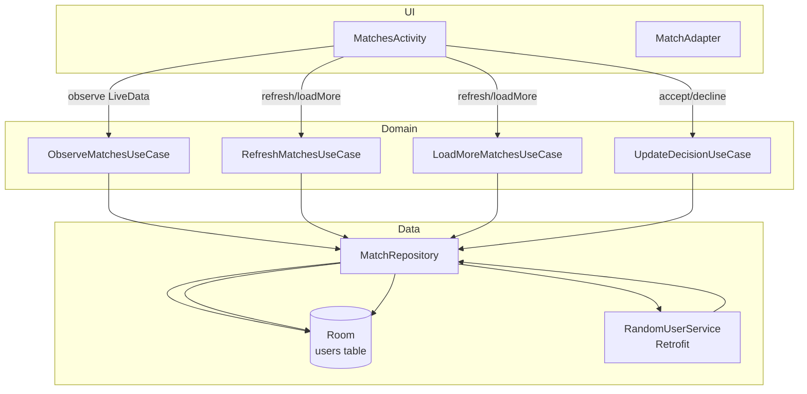
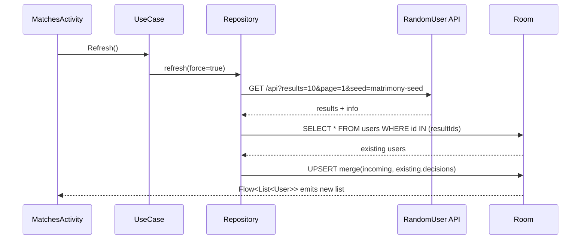

Matrimony (XML, Offline-first)

Overview
Android app that lists potential matches using RandomUser API with an offline-first architecture. The UI is built with XML (no Compose). Data is cached in Room; UI observes DB and supports pull-to-refresh and endless scroll. Users can Accept/Decline; decisions persist locally.

Tech Stack
- UI: XML, RecyclerView, Material 3, SwipeRefreshLayout
- DI: Hilt
- Concurrency: Kotlin Coroutines
- Networking: Retrofit, OkHttp (logging)
- Caching: Room
- Images: Glide (via ImageLoader abstraction planned)
- Architecture: Clean (UI → UseCases → Repository → Data sources)

Features
- Offline-first: UI renders from Room; network refresh updates DB.
- Pagination: Auto-load next page when nearing list end.
- Accept/Decline decisions stored locally and preserved on refresh.
- Error handling: Snackbar with retry; single-consume events.
- LiveData presentation with a single UiState for the screen.

Module Structure
- `data/` remote (Retrofit DTO/API), local (Room), repository implementation
- `domain/` models, mappers (Entity→Domain), use cases
- `presentation/` activities, adapters, viewmodels, UiState, Event
- `di/` modules for Network, Database, Repository, Dispatchers
- `core/` app-wide constants and types

API
- Base: `https://randomuser.me/`
- Endpoint: `/api/?results=10&page=<n>&seed=matrimony-seed`
- Primary key: `login.uuid`

High-Level Design (HLD)
---------------------------------
- Layers: UI (Activities/Adapters/XML) → UseCases → Repository → Data (Room + Retrofit).
- Single Source of Truth: Room. UI always renders from DB; network only updates DB.
- DI: Hilt provides Retrofit, Room, Repository, Dispatchers, and UseCases.
- Images: Glide for efficient image loading and caching.

Architecture diagram


Offline-first data flow



Low-Level Design (LLD)
---------------------------------
- Data model
  - `UserEntity(id, fullName, age, city, state, country, imageLargeUrl, imageThumbUrl, decision, lastUpdatedEpochMs)`
  - `MatchDecision = PENDING|ACCEPTED|DECLINED`
  - Domain `User` mirrors entity but with typed `decision`.

- DAO API
  - `observeAll(): Flow<List<UserEntity>>`
  - `upsertAll(users: List<UserEntity>)`
  - `updateDecision(userId: String, decision: String)`
  - `getByIds(ids: List<String>): List<UserEntity>`
  - `clearAll()`

- Network
  - `RandomUserService.getUsers(results, page, seed): Response<RandomUserResponse>`
  - DTO → Entity mapper: `ResultDto.toEntity(nowEpochMs)`
  - `RandomUserResponse(results: List<ResultDto>?, info: InfoDto?)`

- Repository core logic (simplified)
```kotlin
suspend fun refresh(force: Boolean) {
  val resp = api.getUsers(results=PAGE_SIZE, page=1, seed=DEFAULT_SEED)
  if (!resp.isSuccessful) return
  val incoming = (resp.body()?.results ?: emptyList()).mapNotNull { it.toEntity(now) }
  val existingById = dao.getByIds(incoming.map { it.id }).associateBy { it.id }
  val merged = incoming.map { e -> e.copy(decision = existingById[e.id]?.decision ?: e.decision) }
  if (force) dao.clearAll()
  dao.upsertAll(merged)
}
```

- UseCases
  - `ObserveMatchesUseCase()` → `Flow<List<User>>` from Room
  - `RefreshMatchesUseCase(force)` → triggers refresh
  - `LoadMoreMatchesUseCase()` → fetches next page and upserts
  - `UpdateDecisionUseCase(id, decision)` → updates entity

- ViewModel state
  - `UiState(isLoading: Boolean, users: List<User>, errorEvent: Event<String>?)`
  - Exposed as `LiveData<UiState>`; Activity observes and renders.

State Management
- `UiState(isLoading, users, errorEvent)` exposed as `LiveData<UiState>`.
- Snackbar is shown on error event; retry triggers `refresh()`.

Building & Running
- Android Studio Jellyfish or later
- Min SDK 24, target SDK 36
- Run the `app` module. Entry: `MainActivity` → launches `MatchesActivity`.

Tests
- Unit tests
  - Repository: verifies network→DB upsert and paging using mocked service and DAO
  - ViewModel: verifies UiState transitions on refresh/loadMore and decision updates
- Instrumented tests
  - Room DAO: insert, update decision, observe ordering

Decision persistence policy
- Never overwrite a local decision on network refresh.
- When refreshing, fetch current page → merge with existing rows by `id` → keep previous `decision` → upsert merged list.
- Accept/Decline writes to DB immediately; UI reflects change instantly and persists across app restarts.

Known limitations
- Manual paging, not Paging 3.
- Server is read-only (RandomUser), so decisions are local-only.
- Minimal error categories; message is generic.


string resource
glide
network call
logging
DI for injecting DB in DefaultMatcherRepository
view bindings
randomize the seed on every start