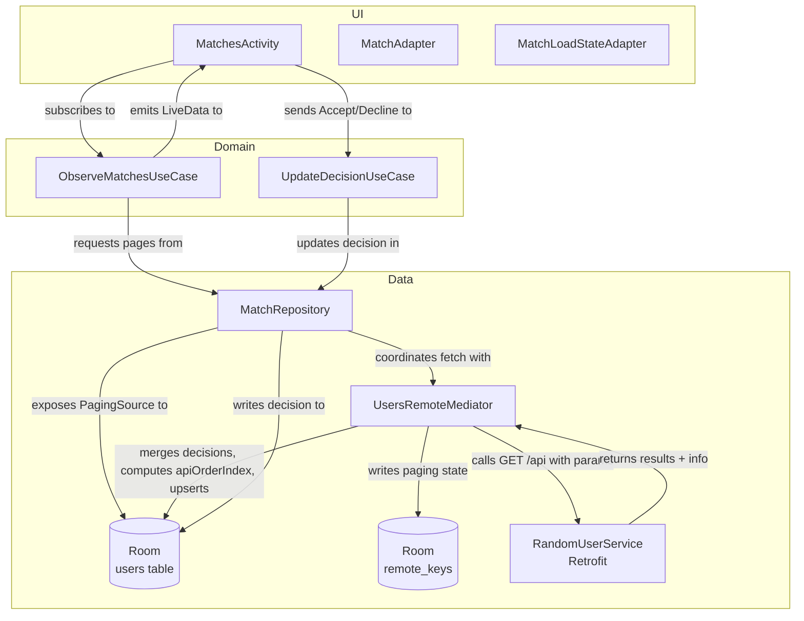
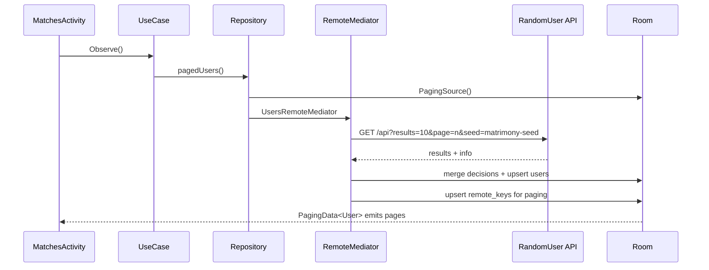

Matrimony (XML, Offline-first)

Overview
Android app that lists potential matches using RandomUser API with an offline-first architecture. The UI is built with XML (no Compose). Data is cached in Room and the list is powered by Paging 3 with a RemoteMediator. Users can Accept/Decline; decisions persist locally across refreshes.

Tech Stack
- UI: XML, RecyclerView, Material 3, SwipeRefreshLayout
- DI: Hilt
- Concurrency: Kotlin Coroutines
- Networking: Retrofit, OkHttp (logging)
- Caching: Room
- Images: Glide (via an ImageLoader abstraction)
- Architecture: Clean-ish (UI → UseCases → Repository → Data sources)
- Pagination: Paging 3 (LiveData + RemoteMediator + Room PagingSource)

Features
- Offline-first: UI renders from Room; network updates DB via RemoteMediator.
- Pagination: Infinite scroll with Paging 3, including proper append/refresh handling.
- Decisions: Accept/Decline writes persist locally and are preserved on refresh.
- Connectivity awareness: Brief toast when offline, continue showing cached results.
- Error handling: Snackbar with retry from the paging footer on load errors.

Module Structure
- `data/` remote (Retrofit DTO/API), local (Room), repository implementation
- `domain/` models, mappers (Entity→Domain), use cases
- `presentation/` activities, adapters, viewmodels, paging load-state footer
- `di/` modules for Network, Database, Repository, Dispatchers, ImageLoader, System services
- `core/` app-wide constants and types

API
- Base: `https://randomuser.me/`
- Endpoint: `/api/?results=10&page=<n>&seed=matrimony-seed`
- Primary key: `login.uuid`

High-Level Design (HLD)
---------------------------------
- Layers: UI (Activities/Adapters/XML) → UseCases → Repository → Data (Room + Retrofit + Paging 3).
- Single Source of Truth: Room. UI always renders from DB; network only updates DB.
- DI: Hilt provides Retrofit, Room, Repository, Dispatchers, and UseCases.
- Images: Glide for efficient image loading and caching.

Architecture diagram


Offline-first data flow



Low-Level Design (LLD)
---------------------------------
- Data model
  - `UserEntity(id, fullName, age, city, state, country, imageLargeUrl, imageThumbUrl, decision, lastUpdatedEpochMs, apiOrderIndex)`
  - `MatchDecision = PENDING|ACCEPTED|DECLINED`
  - Domain `User` mirrors entity but with typed `decision`.

- DAO API
  - `pagingSource(): PagingSource<Int, UserEntity>`
  - `upsertAll(users: List<UserEntity>)`
  - `updateDecision(userId: String, decision: String)`
  - `getByIds(ids: List<String>): List<UserEntity>`
  - `getLastByOrder(): UserEntity?`

- Network
  - `RandomUserService.getUsers(results, page, seed): Response<RandomUserResponse>`
  - DTO → Entity mapper: `ResultDto.toEntity(nowEpochMs, apiOrderIndex)`
  - `RandomUserResponse(results: List<ResultDto>?, info: InfoDto?)`

- Repository core logic (simplified)
```kotlin
@OptIn(ExperimentalPagingApi::class)
override fun pagedUsers(): LiveData<PagingData<User>> =
  Pager(
    config = PagingConfig(pageSize = PAGE_SIZE, enablePlaceholders = false),
    remoteMediator = UsersRemoteMediator(db, service, seed = DEFAULT_SEED),
    pagingSourceFactory = { userDao.pagingSource() }
  ).liveData.map { it.map { e -> e.toDomain() } }
```

- UseCases
  - `ObserveMatchesUseCase()` → `LiveData<PagingData<User>>`
  - `UpdateDecisionUseCase(id, decision)` → updates entity

UI Status chips
- Accepted: green chip background
- Declined: red chip background

Building & Running
- Android Studio Jellyfish or later
- Min SDK 24, target SDK 36
- Run the `app` module. Entry: `MainActivity` → launches `MatchesActivity`.

Tests
- Unit tests
  - Repository: verifies network→DB upsert and paging using mocked service and DAO
  - ViewModel: verifies decision updates reflect in the list
- Instrumented tests
  - Room DAO: insert, update decision, observe ordering

Decision persistence policy
- Never overwrite a local decision on network refresh.
- RemoteMediator merges incoming rows with existing rows by `id` and keeps previous `decision` and `apiOrderIndex`, then upserts the merged list.
- Accept/Decline writes to DB immediately; UI reflects change instantly and persists across app restarts.

Known limitations
- Server is read-only (RandomUser), so decisions are local-only.
- Minimal error categories; message is generic.
Next steps / Enhancements
- Randomize the API `seed` on each fresh app start (persist choice for a session).
- Add visual polish: skeleton placeholders, error/empty states, and list item states.
- Add filter/sort controls (age range, location) on top of the paged list.
- Add swipe gestures for accept/decline with undo.
- Introduce `Detekt`/`Ktlint` and a CI job to keep code quality high.
- Replace placeholder image with a proper avatar placeholder and crossfade.